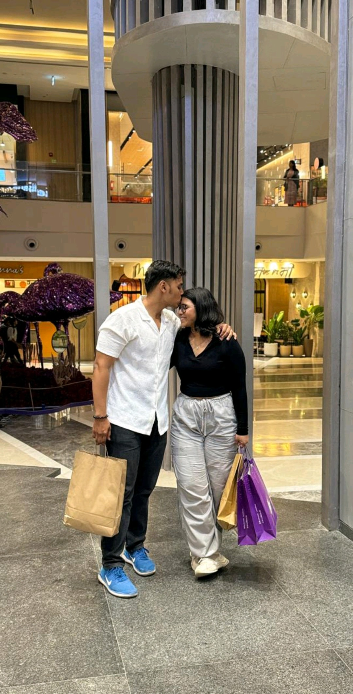
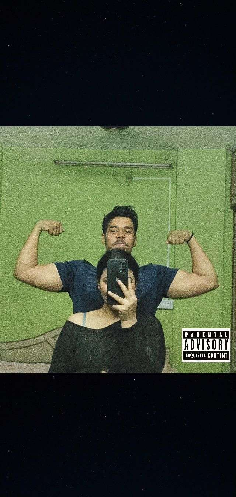

<!DOCTYPE html>
<html>
<head>
<meta name="viewport" content="width=device-width, initial-scale=1">
<title>Happy Valentine's Day ❤️</title>

</head>

<body>

<!-- 🎁 MUSIC -->
<audio id="music" src="music.mp3" loop></audio>

<!-- ❤️ FIRST PAGE -->

  <h1>Happy Valentine's Day ❤️</h1>
  
You mean the world to me...

  <button onclick="startSurprise()">Tap For Your Surprise</button>

<!-- 🎈 BALLOON PAGE -->

  <h2>Pop the balloons 🎈</h2>

  

    

      
🎈

      

    

    

      
🎈

      

    

    

      
🎈

      

    

    

      
🎈

      

    

    

      
🎈

      

    

    

      
🎈

      

    

  

</body>
</html>
